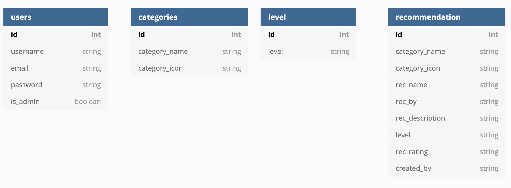

<h1 align="center">
  <a href="">Surround Yourself with Spanish</a>
</h1>


[Surround Yourself with Spanish - Live site](http://surround-yourself-with-spanish.herokuapp.com/get_recommendations)


*Note: This is an extension to the fictional organisation (Dublin Intercambio) created for my earlier Code Institute milestone projects.*

## Introduction
The organisers of Dublin Intercambio want to create a site that allows members to make recomendatiion, and view recommendations from other members for movies, series, books, songs and podcasts
to aid members learn Spanish.

Once language learners get to an intermediatory level they start looking for ways to immerse themselves in the language, to get more input, to listen to native speakers talking naturally with 
different accents, colloquial sayings, slang, etc. Learners are often encouraged to watch movies, read books, listen to songs etc. and this is often discussed at the language exchange events. This is why the organisers of Dublin Intercambio want to create a space online to bring all these recommendations together and that can be shared with their members.

## Scope 
Create a simple, intuitive, and responsive website that acts as a respository of recommendations that users can browse and contribute to. 

The structure should adhere to convention and be simple and intuitive, ensuring the user always knows where they are, how they got there and how to get back to 
where they started.

The design should be simple, utilising the same colour palette, 

Any addition features or functionally are out of scope at this stage.

User goals:
* To find recommendations of Spanish movies, books, series, podcasts and songs from fellow language learners.
* To share recommendations with fellow language learners.
* To improve their Spanish language fluency.
* To be part of a Spanish language learning online community.

Website owners goals:
* To build on and expand the commuity of language learnings that are part of Dublin Intercambio.
* To create a safe and welcoming platform for users to share recommendations of movies, books, etc. to enhance their learning outside of a classroom environment.
* To encourage users to create their own recommendations for other learners based on their language learning journey.
* To build in the ability for admins to edit and delete any uphelpful comments that may be added to ensure the stays safe and welcoming for the language learning community.

## UX

#### User stories

##### A typical user of this site would:
* Have an interest in improving their Spanish language skills.
* Have an interest in learning beyond a textbook.
* Have an interest in being part of a Spanish language learning community.

##### User stories

New Visitors:
1. As a new visitor to the website, I want to understand the purpose of the site and how to interact with it.
2. As a new visitor to the website, I want to find recommendations easily from fellow language learners without the need to register.
3. As a new visitor to the website, I want to be able to register easily and add recommendations.


Logged In Visitor
1. As a logged in visitor to the website, I want to be able to easily add a recommendation.
2. As a logged in visitor to the website, I want to be able to easily edit my recommendations.
3. As a logged in visitor to the website, I want to be able to easily delete my recommendations.
4. As a logged in visitor to the website, I want to be given visual confirmation when I edit or delete my recommendataions that the update has been successful.

Admin
1. As an admin, I want to be able to edit or delete any recommendations to remove any inappropriate content.
2. As an admin, I want to be able to easily add, edit or delete categories within in the site rather than having to access MongoDB.

### Design: 
With this site, I wanted to ensure the design is simple, modern, fully responsive and has a connection to the [Dublin Intercambio](https://donnaib.github.io/dublin_intercambio/)site from my Ms1 project, this connection will be achieved by utilising the same color palette and logo throughout. As before the inspiration for this colour palette was to harness the Spanish connection and influence of the project.

As I have stated before I am aware that yellow can sometimes be a problematic colour, however it remains an important element of the design due the fact that it is a key colour of the Spansih flag. With this in mind special attention as always was given to testing the contract of the white text against the yellow backgrounds to ensure readability.

Here is the colour palette for this site.


Boostrap and Material Design icons are used throughout to realise the simple, modern and fully responsive design.

I used Balsamiq to create detailed Wireframes for mobile and desktop site, for tablet devices the layout will follow either the mobile or desktop views depending on the size of the screen.

### Wireframes

#### Mobile View
Mobile wireframes can be viewed here [Mobile wireframe](static/wireframes/mobile)

#### Larger Screen View
Larger screen wireframes can be viewed here [Larger Screen wireframe](static/wireframes/desktop)

As with my previous project I was very aware that working with yellow in the colour pallete can be problematic. However, as always I was careful to utilize the color in a way that added to the design of the site, but didn't not compromise the accessibility of the site.

## Database Design
All user generated content is stored in MongoDB. There are 4 collections for this site.
1. users
2. categories
3. level
4. recommendations

The recommendations colelctions has an association with the categories and level collections.




## Features

### Pages

#### All Users

###### Home
The home page introduced users to the site and allows them to browse all recommendations made by registered users. Each recommendation features features an icon to distinguish between the different categories, the name of the book, movie, series, etc., the name of the author, director, etc., a description, an indication of the level of Spanish that the recommendation is aimed at, a rating from 1-5 and finally the username of the person who created the recommendation.

If a registered user is logged in, they will also see an edit and delete icon for any recommendation they have created.  These icons are visble for all recommendations if the user is an admin.

###### Register
The registration page allows a user to register an account.  To register a user is required provide a username, email and password. Validation has been added to form.  The Registration page also provided a link to the Log In page if a user has already registered and simply needs to log in.

###### Log In
The Log in page allows registered user to log in to their account in order to view their own recommendations, add a new recommendation, edit or delete one of their own recommendations. The Log In page also provides a link to the Registration page if a user hasn't yet registered.

#### Logged In Users

###### My Recommendations
This page is individual to the user and displays all of their recommendations in one place, allowing a user to easily find their recommendations should they wish to edit or delete one.

###### Add Recommendation
This page displays a form to the user to enable them to add a recommendation. The user first selects a category from a dropdown list, then enter the details of their recommendation, and finally selected a level from the options in the dropdown and chose a rating from 1-5. The user then clicks submit and their recommendation is saved in MongoDB and visible in the site.

This page is not accessible to user that are not logged in.

###### Edit Recommendation
This page displays a form to the user to enable them to edit one of their recommendations. The same form that is used to add recommmendations is shown again and is prefilled with the original information. The user can then edit their recommendation and click the edit button to update their recommendation or there is the option to click cancel if they have changed their mind and no longer want to make any edits.

This page is specific to the recommendation that has been seleted to edit and is only avaiable to the created of the recommendation when they are logged in, or to admin.

#### Admin Only

###### Categories
This is an admin only area and allows an admin to create, edit and deleted categories on the front end. This page displays a list of categories available to users, the categories have an edit and delete icons to allow an admin to either make edits to a category or to delete one. The page also has an 'Add Category' button to allow an admin to create a new category. 

###### Add Category
This is an admin only area and allows an admin to create a new category.  This page consists of a form that asks the admin to provide the name of the new category and the name of the material design icon that should be used for that icon in the recommendations card. Once submited this is added to the Categories collection in MondgoDB and is available to users to select from the dropdown menue when they add a new recommendation.

###### Edit Category
This is an admin only area and allows an admin to edit a new category.  This page consists of a form that is prepopulated with the orginal information about that category. The admin can then edit the category and click the edit button to update the category or there is the option to click cancel if they have changed their mind and no longer want to make any edits.

Once submited this is added to the Categories collection in MondgoDB and is available to users to select from the dropdown menu when they add a new recommendation.

### Site Features 
Every page on this site also incorporates the following features:
* A logo in the top left hand corner, that not only forms part of the branding and design of the site but also as is consistent with a user's expectations, clicking the logo will return the user to the home page of the site.
* A responsive, collapsible navigation bar, allowing users to easily navigate the site on any device.

### Possible Features to Implement in Future
* Option to add the option to  filter recommendations based on category as well  level.
* Password verification on registration form.
* Server side form validation.


## Technologies Used for building this site
- This project uses HTML, CSS, Javascript & Python programming languages.
- This project uses Flask and the following Flash extentions - please see requirements.txt for full list of extentions. 
- This project uses MongoDB for database functionality.
- This project is deployed using Heroku.


### Tools, Libraries, 
- [Gitpod](https://gitpod.io/workspaces) was used an the IDE for building the site.
- [Bootstrap](https://getbootstrap.com/) was used to assist with the structure, responsiveness and browser compatibility of the site. 
- [Material Design](https://fonts.google.com/icons) was used for the icons in the site.
- [JQuery](https://jquery.com/) to reference Javascript needed for the responsive navbar.
- [Popper JS](https://popper.js.org/) reference Javascript needed for the responsive navbar.
- [Balsamiq](https://balsamiq.com/) was used for creating my wireframes.
- [favicon.io](https://favicon.io/) was used for creating favicon.
- [Am I Responsive?](http://ami.responsivedesign.is/) was used for creating image at start of README.

## Testing

I tested the site in the following ways:

1. Initially I used the inspector tool to test the site in all the screen sizes and devices available in the Chrome developer tool.  In addition to this I also tested it on live devices, including but not limited to iPhone, iPad, MacBook Pro, MotoG7. 

2. I also viewed my site in multiple browsers including, Chrome, Firefox and Safari.

3. I also tested my code using the validator tools for my HTML [W3C HTML Validator Tool](https://validator.w3.org/), CSS [W3C CSS Validator Tool](https://validator.w3.org/) and Python [PEP88 Online](http://pep8online.com/).

Screen shots of the HTML & CSS validator results can be viewed by clicking on the link below, as you will see there were no errors detected.

[Validation Reports](static/readme_images/testing)


3. All links were tested to ensure there were no broken links and that all links to external sites open in a new tab.

4. In addition to testing with the inspector tool, real devices and validation tools, I also work through a series of test cases, to ensure that the site met the users stories and that any functionality that was added worked as intended.

### User Story Test Cases

#### New Visitors
1. As a new visitor to the website, I want to understand the purpose of the site and how to interact with it.

 - The home page of the site features a title and an introduction with an explanation of the purpose of the site and how to interact with it.

2. As a new visitor to the website, I want to find recommendations easily from fellow language learners without the need to register.

 - There is no requirement to register to view recommendations. The recommendations are the main feature of the site and are visible from the home page for all visitors to view.

3. As a new visitor to the website, I want to be able to register easily.

 - The nagvigation is clear and has a item named 'Register', when a user clicks on this nav item they are brought to a simple form, with clearly lablled fields, placehold text and a clearly marked 'Register' button.

#### Logged In Visitors

1.   As a logged in visitor to the website, I want to be able to easily add a recommendation..

 - When a user logs into the site there are now options available to them in the navigation bar. When a users click 'Add Recommendation' in the navigation bar, they are taken to the add_recommedations page. This page displays a form to the user to enable them to add a recommendation The user first selects a category from a dropdown list, then enter the details of their recommendation, and finally selected a level from the options in the dropdown and chose a rating from 1-5. The user then clicks submit and their recommendation is saved in MongoDB and visible in the site.

2. As a logged in visitor to the website, I want to be able to easily edit my recommendations.

 - When a user logs into the site there are taken to their recommendations, from there they can easily view, or select to edit or delete their recommendations. If they click on the pencil icon within a recommendation the are taken to a page that consists of a form that is prepopulated with the orginal recommendation data. The user can then then edit their recommendation and click the edit button to update the recommendation or there is the option to click cancel if they have changed their mind and no longer want to make any edits.

3. As a logged in visitor to the website, I want to be able to easily delete my recommendations.

 - When a user logs into the site there are taken to their recommendations, from there they can easily view, or select to edit or delete their recommendations. If they click on the bin icon within a recommendation a pop up modal appears asking the user to verify that they want to delete their recomendation. If the users click the delete button on the modal, their recommendation is delete from the database and no longer appears in the site.

4. As a logged in visitor to the website, I want to be given visual confirmation when I edit or delete my recommendataions that the update has been successful.

 - When a user is logged in and and adds, edits or deletes a recommendation a message is flashed to confirm that the action has been carried out successfully.

#### Admin
1. As an admin, I want to be able to edit or delete any recommendations to remove any inappropriate content.

 - When an admin is logged in, the edit and delete icons are available to them on all recomentations allowing then to edit or delete any inappropriate recommendations.

2. As an admin, I want to be able to easily add, edit or delete categories within in the site rather than having to access MongoDB.

 - When an admin is logged in a new nav item is added called Categories. Clicking on this page allows an admin to view exisiting catgories, as well as edit or delete them. Additionally there is an add category button allowing then to add a new category on the front end.


### Functionality Test Cases
Home:
1. While logged out make sure that you can see all recommendations that are on the home page, and that each recommendations included the follow:
	- Category Icon
	- Name
	- By
	- Description
	- Level
	- Start rating
	- Created by

2. While logged out ensure that you can only see 'Home', 'About', 'Log In', and 'Register' in the navigation bar.
3. While logged in, make sure all recommendations still have the fields detailed in step 1 and that any recommendation that was created by you, now has the pencil and bin icon visible.
4. While logged in as an admin, make sure all recommendations still have the fields detailed in step 1 and that all recommendations now have the pencil and bin icon visible.

Home: Search funtionality
1. Type a word into the search box that you know there isn't match for in the DB, ensure that the flash messaging saying that there are no matches to your search.
2. Click the reset button and ensure all Reccomendations are visble again.
3. Type the name of a book, or author that you know appears in your DB into the search box, ensure only recommendations that match that criteria are visible.

Home: Filter functionality
1. Click on the word filter above the recommendations and ensure the filter option buttons are visible.
2. Click on each button in turn and ensure that only recommendations that match that filter are visble.
3. Ensure there is one filter option that has no corresponding entries in the DB and then click on the option, ensure the flash messagin saying there are no matching recommendations.

About: 
1. While logged out ensure you can access this page and the text loads.
2. Log in and ensure you can access this page and that the text loads.
3. Click the the external link to Dublin Intercambioach on the page and ensure that it opens in a new tab.
4. Click the 2 internal links in the last paragraph and ensure you are redirect to the corresponding page.

Registration:
1. Firstly complete the fields, click submit and ensure that the data is saved to the DB.
2. Attempt to submit the form with empty fields and ensure that valitation errors are displayed.
3. Attempt to submit the form without a correctly formatted email address and ensure validation error is displayed.
5. Log in with valid data and ensure flash message is show to confirm that the data has been submitted.
6. Log in with valid data and enusre you are taken to the My Recommendations page.
7. Attempt to register with a username that you know already exists and ensure the error message is shown and you are redirected back to the register form.
8. Attempt to register with an email that you know already exists and ensure the error message is shown and you are redirected back to the register form.
9. Click on the 'Log In' link at the bottom of the registration form and ensure you are taken to the Log In screen.
10. While logged out ensure that you can only see 'Home', 'Log In', and 'Register' in the navigation bar.

Log In:
1. Log in with valid credentials and ensure you are logged in and directed to your My Recommendations page and you can now see 'My Recommendations', 'Add Recommendations' and 'Log Out' in the navigation.
2. Attempt to log in with invalid credentials and ensure that an error message is displayed on screen and you are redirected to the Log In screen.
3. Click on the 'Register here' link at the bottom of the form and ensure you are taken to the Registration Screen.

Log Out:
1. While logged in, click on the 'Log Out' item in the navigation bar and ensure that you are logged out, that you see the success confirmation message and that you can now only see 'Home', 'Log In', and 'Register' in the navigation bar.

My Recommendations:
1. While logged in, navigate to the My Recommendations page and ensure you can see all the recommendations that you have added.
2. While on the My Recommendations page ensure that the pencil and bin icons are visible in your recommendations.
3. While on the My Recommendations page click on the pencil icon and ensure that the Edit Recommendation page opens.
4. While on the My Recommendations page click on the bin icon and ensure that a pop up verification modal appears.
5. Copy URL for My Recommendations page, then log out, paste the URL into the browser and try to access the page while logged out. Ensure you get a 404 error page.

Add Recommendation:
1. While logged in, navigate to the Add Recommendations page and ensure the form loads and all fields are visible
2. While on the Add Recommendations page ensure that all the categories are visible in the category drop down.
3. While on the Add Recommendations page ensure that all the levels are visible in the level drop down.
4. While on the Add Recommendations page try to submit the form with fields left blank, ensure that custom valitation message is shown. Do this with each field in turn.
5. While on the Add Recommendations page try to submit the form with blank spaces entered into the fields and ensure validation messages are shown.
6. While on the Add Recommendations page complete all fields and submit the form, ensure the new entry is saved in the DB and is visible in the recommendations page.
7. Copy URL for Add Recommendations page, then log out, paste the URL into the browser and try to access the page while logged out. Ensure you get a 404 error page.


Edit Recommendation:
1. While logged in, navigate to the Edit Recommendations page and ensure the form loads and all fields are visible and pre populated with the data for that recommendation.
2. While on the Edit Recommendations page ensure that all the categories are visible in the category drop down.
3. While on the Edit Recommendations page ensure that all the levels are visible in the level drop down.
4. While on the Edit Recommendations page try to submit the form with fields left blank, ensure that custom valitation message is shown. Do this with each field in turn.
5. While on the Edit Recommendations page try to submit the form with blank spaces entered into the fields and ensure validation messages are shown.
6. While on the Edit Recommendations page make an edit to the recommendation and click the edit button, ensure the new edited version is saved in the DB and the edited version is visible in the recommendations page.
7. While on the Edit Recommendations page don't make any changes and click the cancel button, ensure you are taken back to the recommendation page.
8. Copy URL for Edit Recommendations page, then log out, paste the URL into the browser and try to access the page while logged out. Ensure you get a 404 error page.

Delete Recommendation:
*Carry out the test below from both the Recommendations and My Recommendations page*

1. Click the delete icon within a recommendation, ensure that a delete verification modal appears.
2. When the modal has appeared, click the cancel button and ensure the modal closes and the recommendation is still visible on the page.
3. Click the delete icon again, this time click the delete button. Ensure the recommendetation is deleted and the confrimation flash message is visible.  Take care to ensure that the correct recommendation has been deleted i.e. the one in which you click the delete icon.


Category & Add Category Pages (Admin Only):
1. While logged in and admin navigate to the Categories page and ensure all existing categories are visible with the option to edit or delete.
2. While on the Categories page click on the Add Category button and ensure the form opens.
3. While on the Add Categories page try to submit the form with fields left blank, ensure that custom valitation message is shown. Do this with each field in turn.
4. While on the Add Categories page try to submit the form with fields left blank, ensure that custom valitation message is shown. Do this with each field in turn.
5. While on the Add Categories page try to submit the form with blank spaces entered into the fields and ensure validation messages are shown.
6. While on the Add Categories page complete all fields and submit the form, ensure the new entry is saved in the DB and is visible in the categories page.
7. Copy URL for Add Categories page, then log out, paste the URL into the browser and try to access the page while logged out. Ensure you get a 404 error page.


Edit Category (Admin Only):
1. While logged in and admin navigate to the Categories page and click the edit icon on one of the categories and form loads and all fields are visible and pre populated with the data for that category.
4. While on the Edit Categories page try to submit the form with fields left blank, ensure that custom valitation message is shown. Do this with both fields.
5. While on the Edit Categories page try to submit the form with blank spaces entered into the fields and ensure validation messages are shown.
6. While on the Edit Categories page make an edit to the recommendation and click the edit button, ensure the new edited version is saved in the DB and the edited version is visible in the categories page.
7. While on the Edit Categories page don't make any changes and click the cancel button, ensure you are taken back to the categories page.
8. Copy URL for Edit Categories page, then log out, paste the URL into the browser and try to access the page while logged out. Ensure you get a 404 error page.


Delete Category (Admin Only):

1. Click the delete icon within a category, ensure that a delete verification modal appears.
2. When the modal has appeared, click the cancel button and ensure the modal closes and the category is still visible on the page.
3. Click the delete icon again, this time click the delete button. Ensure the category is deleted and the confrimation flash message is visible.  Take care to ensure that the correct category has been deleted i.e. the one in which you click the delete icon.


### Accessibility
In addition to all the above testing I also checked my site with accessibility tools in the inspector. 

### Bugs
During the development of this site I encountered a number of different bugs that have been now been fixed. A few notable bugs include the following:
1. During testing it was highlighted that a user could enter empty spaces and submit the forms. I search online and adapted my code based on information I found in this stack overflow page [Stack overflow](https://stackoverflow.com/questions/27384198/bootstrap-validator-regex-no-space)

2. After initially creating user only and admin only pages, although the navigation to those pages weren't accessible, they could still be reached if the full URL waa pasted into the browswer.  I updated my code to check that the user was logged in and added a check to ensure the users had rights to edit or delete the recommendations or that the user was an admin and therefore had overall rights.


## Deployment UPDATE TO HEROKU

### Requirements

- Python3
- PIP package installation
- Github account
- MongoDB account
- Heroku account 

All user generated content is stored in MongoDB. There are 4 collections for this site.
1. users
2. categories
3. level
4. recommendations
(See DB design for details of the documents within each collection)


### How to run this project locally
To clone this project from GitHub:
1. Follow this link to the [Project GitHub repository](https://github.com/DonnaIB/surround_yourself_with_spanish).
2. Under the repository name, click 'Code'


3. In the Clone with HTTPs section, copy the clone URL for the repository. 
4. In your local IDE open Git Bash.
5. Change the current working directory to the location where you want the cloned directory to be made.
6. Type ```git clone```, and then paste the URL you copied in Step 3.
```console
git clone https://github.com/DonnaIB/surround_yourself_with_spanish.git
```
7. Hit enter and your local clone will be created.

8. Open the index.html file to run the project locally

9. Create a file called env.py. Your app's environmental variables should be added to this file

10. The env.py file should contain the following information:


		os.environ.setdefault("IP", "0.0.0.0")
		os.environ.setdefault("PORT", "5000")
		os.environ.setdefault("SECRET_KEY", "<app secret key>")
		os.environ.setdefault("MONGO_URI", "< get URI from MongoDB >")
		os.environ.setdefault("MONGO_DBNAME", "<database_name>")
		
11. Check that the env.py file is listed in the .gitignore file

12. Run the app locally by typing 'python3 app.py' in the terminal


### Heroku Deployment 

1. Create a requirements.txt and Procfile:
	
	In the terminal type:
	 - 'pip3 freeze --local > requirements.txt'
	 - echo web: python3 app.py > Procfile

2. Push the above files to your Github account
3. Log into Heroku and create a new app: 
	
	- Click 'New' and select 'Create new app'
	- Choose a name for the app (remember this must be a unique name)
	- Choose your region
	- Click 'Create app' button

4. Connect to Github:
	
	- If not already on the Deploy tab, click the Deploy tab
	- Select Github as the deployment method and enter your Github details as prompted
	- Select the correct repsoitory and click connect

5. Add Config Vars:

	- Click on the settings tab
	- In the Config Vars section click 'Revel Config Vars'
	- Enter the key value pairs, making sure they match exactly what you have in your env.py file:
			IP: 0.0.0.0
			PORT: 5000
			SECRET_KEY: <secret key>
			MONGO_URI: <mongodb+srv://<username>:<password>@myfirstcluster.jwlzm.mongodb.net/<database name>?retryWrites=true&w=majority>
			MONGO_DBNAME: <db name>


6. Deploy the App
	
	- In the Automatic Deploys section choose a branch to deploy
	- Click Enable Automatic Deploys

7. When the app build is complete, click 'Open App' button to open the app


## Credits

### Content
The content of the site was written by myself and inspired by my Ms1 and Ms2 fictional projects.

### Code
- Code for my navigation was adapted from my Ms2 project which in turn was adapted and customised from a code snippet found in the Bootstrap documentation.
- Code for my footer was adapted from my Ms2 project. 
- I adapted the code from [Bootstrap documentation examples](https://getbootstrap.com/docs/4.0/components/card/) Bootstrap documenation for the main structure of the my recommendations.


### Acknowledgements
* My color scheme for this site was based on the colors in the Spanish flag and I used a colour scheme from [Scheme Color](https://www.schemecolor.com/spain-flag-colors.php), the specific color combination was created by user Keshav Naidu.
* I would like to thank igor_ci, Ed_B Lead & Eventyret_mentor in the Slack community for helping answering various questions and pointing me in the right direction during my Ms3 project.
* A final thank to my mentor Precious Ijege who has advised and guided me through this Milestone 3 project.
